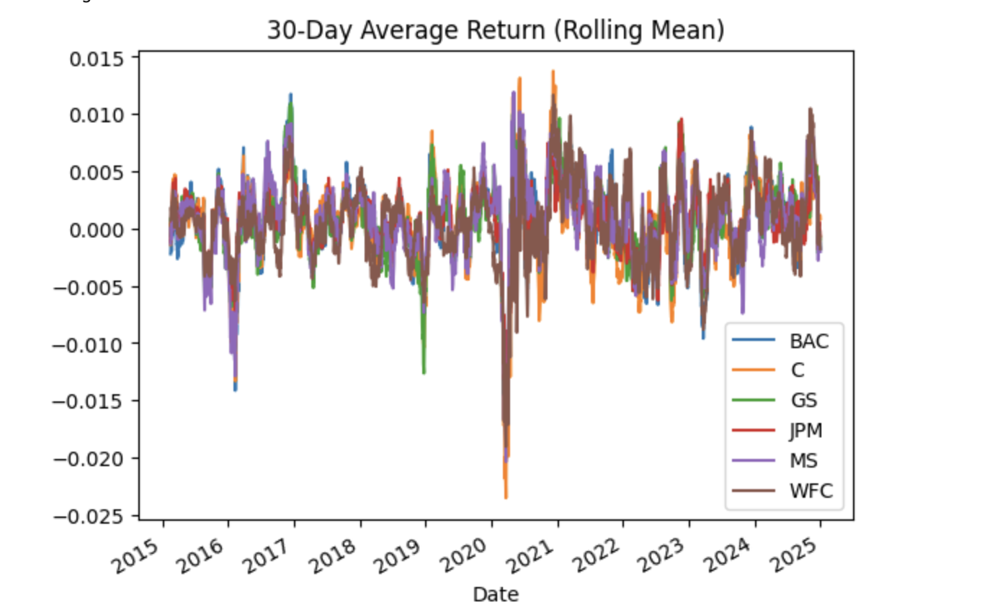

# Bank_Stocks_Analysis
This project analyzes major US banks' stock prices and returns using Python. 

It includes:

- Data download using Yahoo Finance (`yfinance`).
- Daily returns and cumulative returns calculation.
- Rolling statistics (mean, standard deviation).
- Visualization using `matplotlib`, `seaborn`.

## Banks Included
- Bank of America (BAC)
- CitiGroup (C)
- Goldman Sachs (GS)
- JPMorgan Chase (JPM)
- Morgan Stanley (MS)
- Wells Fargo (WFC)

# Rolling Mean of Bank Stock Returns

# Cumulative Returns of Banks

